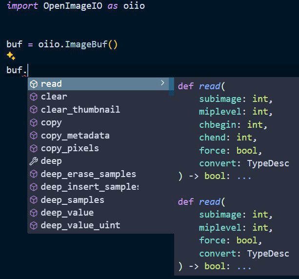

# 🔍 **types-oiio-python**

**Type stubs for OpenImageIO Python bindings!**

This package provides type stubs for [oiio-python](https://github.com/pypoulp/oiio-python), enabling static type checking and better IDE support for OpenImageIO and OpenColorIO Python bindings.

[](https://pepy.tech/projects/types-oiio-python)

---

## **Features**

- **🎯 Complete Type Coverage**: Type hints for OpenImageIO and PyOpenColorIO modules
- **🚀 IDE Support**: Enhanced code completion and type checking
- **✨ MyPy Compatible**: Full support for static type checking
- **🔄 Version Matched**: Stubs versions match `oiio-python` releases

---

## **Installation**

```bash
pip install types-oiio-python
```

It is recommended to add this package to your project development dependencies.


## **Usage**

Once installed, MyPy and your most IDEs will automatically use these stubs for type checking and code completion.
| Autocomplete                    | Type Checking                    |
| ------------------------------- | -------------------------------- |
|  |  |
| (Example in VS Code)            | (Example in VS Code)             |

### Note for Pylint users

Unfortunately Pylint does not (yet) support the use of stubs int the .pyi format.

If you use Pylint, you will need to add the following to your `.pylintrc` file:

```ini
extension-pkg-whitelist=OpenImageIO,PyOpenColorIO
```
To avoid getting `E1101:no-member` errors when using compiled modules.


## **Version Compatibility**

The version numbers match the corresponding oiio-python releases. For example:
- types-oiio-python 2.5.12.0.x corresponds to oiio-python 2.5.12.0.x

## **Development Notes**

 - The stubs are generated using mypy's stubgen tool.
 - Included `generate_stubs.py` script is used to generate stubs for OpenImageIO and OpenColorIO modules. 
 - Manual adjustments are made to improve the generated stubs.

1. Clone the repository
2. Install in interactive mode with dev dependencies
    ```bash
    pip install -e .[dev]
    ```
1. Test the stubs with MyPy stubtest
    ```bash
    stubtest OpenImageIO --allowlist oiio-mypy-baseline.txt
    stubtest PyOpenColorIO --allowlist ocio-mypy-baseline.txt
    ```
